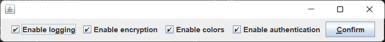
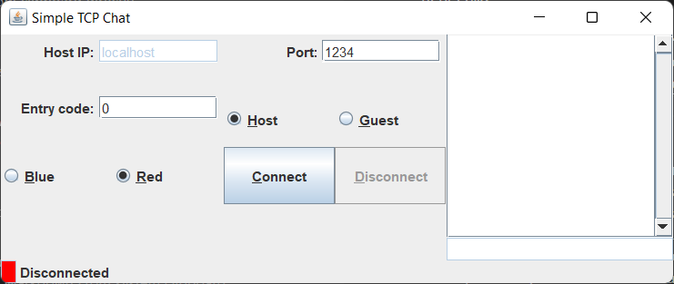
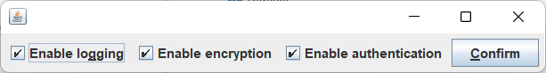

# Documentation Assignment 3 SPL, group 9

For this assignement, we used the pre-processor language *Munge* to create three seperate versions of our program, with different features meant for different use-cases. These are the following:

1) **Full:** all features are optional, and can be selected through a selection screen at runtime. This version is meant both as the main branch for development and the 'fullest' version of the program.

    For reference, the feature selection and chat screen look as follows:
    
    

2) **Grey:** meant for systems with black-and-white screens, this version has coloured text disabled. (This means the all text is send as neither red nor blue.)
   
   For this version, the screens look like this:
   
   .png)
   
3) **Safe:** meant for environments where safety is important, this version makes it impossible to disable authentication.

    This means chat screen looks like the default one, but the configuration screen looks as follows:
    

